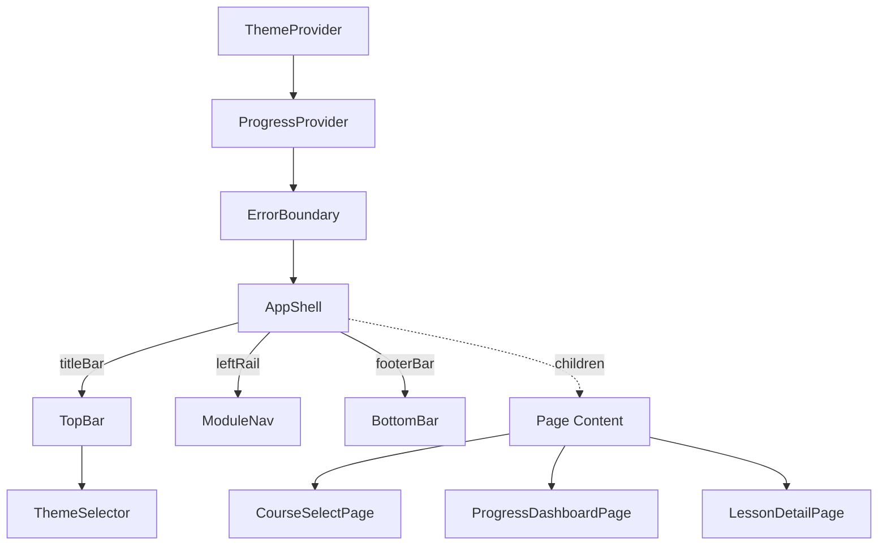
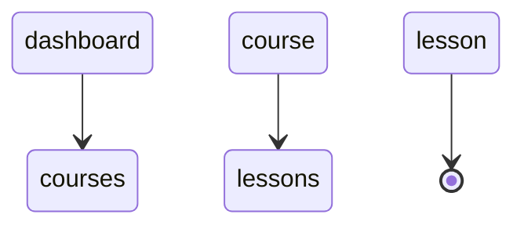
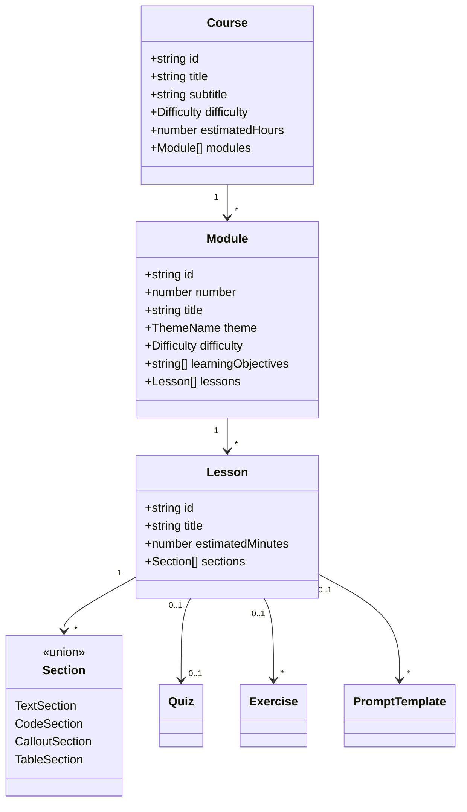

# Diagrams Deck Extension — Design Spec

**Date:** 2026-04-11
**Status:** Draft
**Audience:** Development team (internal reference)

## Problem

The existing `standalone-diagrams-deck.tsx` catalogs visual primitives (layouts, components, lists, shapes, recipes) but does not diagram the actual component architecture, data flow, navigation state machine, or data model of the training platform. The dev team needs these as architectural reference material, rendered inside the same deck for consistency.

## Decision Summary

- **Approach:** Mermaid.js for structural diagrams + hand-built JSX for data flow (Approach A)
- **Scope:** Add 4 new sections to the existing 5 (total: 9 sections)
- **Rendering:** Mermaid `graph TD`, `stateDiagram-v2`, `classDiagram` themed via CSS custom properties; hand-built JSX reusing existing card/connector vocabulary
- **Bundle:** Mermaid inlined via `viteSingleFile`, ~150KB addition to the standalone HTML

## Deck Structure

### Existing Sections (unchanged)

| # | ID | Title | Icon |
| --- | ----- | ------- | ------ |
| 1 | `layouts` | Layouts | `LayoutGrid` |
| 2 | `components` | Components | `Component` |
| 3 | `lists` | Lists & Flows | `CheckSquare` |
| 4 | `shapes` | Shapes & Connectors | `Shapes` |
| 5 | `recipes` | Deck Recipes | `Library` |

### New Sections

| # | ID | Title | Subtitle | Icon | Rendering |
| ---
| 6 | `architecture` | Architecture | Component hierarchy and slot composition | `Layers3` | Mermaid |
| 7 | `dataflow` | Data Flow | Context providers, state ownership, prop threading | `Spline` | Hand-built JSX |
| 8 | `navigation` | Navigation | Route state machine and lesson sequencing | `Milestone` | Mermaid |
| 9 | `datamodel` | Data Model | Type relationships and legacy adapters | `Diamond` | Mermaid |

All four Lucide icons (`Layers3`, `Spline`, `Milestone`, `Diamond`) are already imported in the file.

## Mermaid.js Integration

### Installation

- Add `mermaid` as a dev dependency in `training-app/package.json`
- `viteSingleFile` inlines it into the standalone HTML (~150KB gzipped addition)

### Initialization

Import mermaid in `standalone-diagrams-deck.tsx` and call `mermaid.initialize()` once at module scope with `theme: 'base'` and variable overrides mapped from the deck's CSS custom properties.

### MermaidDiagram Component

A small wrapper component:

```tsx
function MermaidDiagram({ definition, id }: { definition: string; id: string }) {
  const ref = useRef<HTMLDivElement>(null);

  useEffect(() => {
    if (ref.current) {
      mermaid.render(id, definition).then(({ svg }) => {
        ref.current!.innerHTML = svg;
      });
    }
  }, [definition, id]);

  return <div ref={ref} className="mermaid-diagram" />;
}
```

### Theme Mapping

Mermaid `theme: 'base'` accepts `themeVariables`. Map from the deck's existing CSS tokens:

| Deck Token | Mermaid Variable | Purpose |
|------------|-----------------|---------|
| `--text-primary` | `primaryTextColor` | Node labels |
| `--surface-code` | `primaryColor` | Node backgrounds |
| `--surface-elevated` | `mainBkg` | Diagram background |
| `--border-subtle` | `lineColor` | Edges and borders |
| `--accent-info` | `primaryBorderColor` | Highlighted node borders |
| `--accent-action` | `activeTaskBorderColor` | Active/current states |
| `--text-secondary` | `secondaryTextColor` | Secondary labels |
| `--text-muted` | `tertiaryTextColor` | Annotations |

Diagrams automatically adapt when the user switches deck themes.

## Section Designs

### 6. Architecture Section

**Diagram 6a — Provider & Shell Nesting** (Mermaid `graph TD`)

Shows the full component hierarchy from providers down to leaf components:



**Diagram 6b — Slot Composition Variants** (Mermaid `graph TD` with subgraphs)

Three subgraphs showing how AppShell slots are filled differently in:

1. **Main App** — Full routing: TopBar + ModuleNav + BottomBar + routed page content
2. **Standalone Course** — Scoped to single course: TopBar + ModuleNav (filtered) + BottomBar + StandaloneDashboardPage or LessonDetailPage
3. **Diagrams Deck** — No ProgressProvider, no ModuleNav: TopBar + custom DiagramNav + BottomBar + DiagramsDeckPage

Each subgraph highlights which slots are filled and which are absent/replaced.

### 7. Data Flow Section

**Diagram 7a — Context Provider Flow** (Hand-built JSX)

Visual tree using the deck's existing card shapes showing:

- **ThemeContext card** providing: `theme`, `preference`, `setPreference`, `getModuleTheme()`
  - Arrows to consumers: `TopBar` (ThemeSelector), `AppShell` (data-theme), `ModuleNav` (active highlight)
- **ProgressContext card** providing: `currentModuleId`, `currentLessonId`, `completedLessons`, `markLessonComplete()`, `quizScores`, `notes`, `getNote()`, `saveNote()`
  - Arrows to consumers: `ModuleNav` (completion badges), `BottomBar` (mark complete), `NotesDrawer` (get/save note), `LessonDetailPage` (quiz scores)

Uses the existing connector/arrow shapes from the Shapes & Connectors section. Provider cards styled with `--accent-special` border; consumer cards with `--accent-info` border.

**Diagram 7b — State Ownership** (Hand-built JSX)

Grid of cards, one per stateful component, showing:

| Component | Owns (local state) | Receives (props/context) |
|-----------|-------------------|------------------------|
| `App` | `viewState`, hash sync | — |
| `AppShell` | `leftOpen`, `isMobile` | `titleBar`, `leftRail`, `footerBar`, `children` |
| `TopBar` | `notesOpen` | `module`, `lesson`, `leftOpen`, callbacks |
| `ModuleNav` | — | `modules`, `activeModuleId`, `activeLessonId`, `completedLessons` |
| `BottomBar` | — | `onPrev`, `onNext`, `canGoPrev`, `canGoNext`, `isCompleted` |
| `LessonDetailPage` | `activeSectionIndex`, scroll position | `module`, `lesson`, progress context |

Rendered as styled cards using the deck's existing card vocabulary, with "owns" items in `--accent-action` and "receives" items in `--accent-info`.

### 8. Navigation Section

**Diagram 8a — Route State Machine** (Mermaid `stateDiagram-v2`)



Each state annotated with its hash pattern:

- `courses` → `#courses`
- `dashboard` → `#dashboard`
- `lesson` → `#lesson/{moduleId}/{lessonId}`

**Diagram 8b — Lesson Navigation Sequence** (Mermaid `graph LR`)

Shows `flattenLessons()` producing a linear chain across modules:

```
Module 1         Module 2         Module 3
[L1] → [L2] → | [L3] → [L4] → | [L5] → [L6]
         ↑ prev    next ↑
         └── BottomBar ──┘
```

Prev/Next step through the flat list. `markLessonComplete()` toggles completion state per lesson. Module boundaries shown as vertical dividers.

### 9. Data Model Section

**Diagram 9a — Core Types** (Mermaid `classDiagram`)



**Diagram 9b — Legacy Adapter Pattern** (Mermaid `graph LR`)

Shows the transformation pipeline:

```
Legacy flat lessons (modules/*.ts)
    ↓ moduleFromLegacy()
Single-lesson Module
    ↓ mergedModule()
Multi-lesson Module (combined)
    ↓ splitModuleFirstHalf() / splitModuleSecondHalf()
Half-modules (split for pacing)
    ↓ curriculum.ts courses[]
Course (GET TESTING / BUILD SKILLS / GO PRO)
```

Contrasted with the native course path:

```
courses/first-playwright-tests/modules/*.ts
    → firstPlaywrightTestsCourse (direct)
```

## Files Changed

| File | Change |
|------|--------|
| `training-app/package.json` | Add `mermaid` dev dependency |
| `training-app/src/standalone-diagrams-deck.tsx` | Add 4 sections to array, import mermaid, add `MermaidDiagram` component, add `ArchitectureSection`, `DataFlowSection`, `NavigationSection`, `DataModelSection` components |

No new files needed — all changes are within the existing standalone entry point.

## Out of Scope

- Standalone build pipeline diagrams (explicitly excluded)
- Changes to the 5 existing sections
- New standalone entry points or vite configs
- Interactive/draggable diagrams (D3/React Flow — rejected in approach selection)

## Success Criteria

- All 9 sections render in the diagrams deck
- Mermaid diagrams adapt to all 6 deck themes
- `pnpm build:diagrams-deck` produces a working single-file HTML
- Diagrams accurately reflect the current codebase architecture
- No regressions in existing 5 sections
